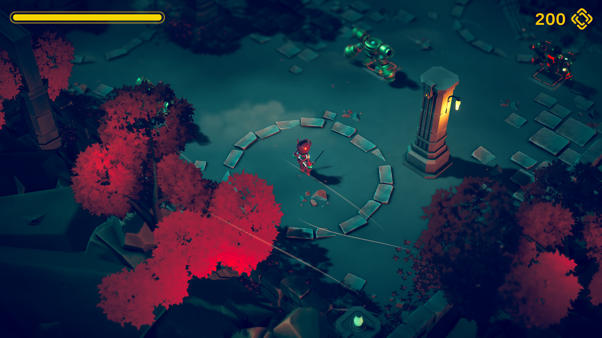

# Little Adventure
I created a simple 3D rogue-like game using Unity.

## Game name
Little Adventurer  

## Objective
- The goal of the game is to defeat all waves of enemies, survive, and reach victory once all enemies are cleared.

## Component 
- **Player**  
The main character controlled by the player.  
Can move, roll, and attack using melee weapons.  
Has health, coins, and rolling mechanics.

- **Enemy:**  
Two types of enemies (Enemy1 – melee, Enemy2 – ranged).  
Each uses AI navigation to chase or shoot at the player.

- **Gates:**  
Opens automatically after each wave of enemies is defeated, unlocking new areas.

- **UI Manager:**  
Controls enemy wave spawning.  
Each wave activates when the previous one is cleared.

- **UI Systems:**  
Handles pause, victory, failure screens, and health/coin updates.

- **VFX System:**  
Manages visual effects such as footsteps, blade slashes, healing, and attack particles.

## Gameplay

- Move using WASD keys.
- Left Mouse Button to attack.
- Spacebar to roll and evade attacks.
- Defeat enemies to open gates and progress through waves.
- Collect medical packs to restore HP.
- Victory occurs when all enemies are defeated;  
Failure occurs if the player's HP reaches zero.

## Technical Features

- Rigidbody-based character movement and physics.
- NavMesh-based enemy AI with pathfinding.
- Animation Events controlling attack timing and VFX activation.
- Dynamic health and coin UI updates.
- Gate and wave progression logic handled by Spawner.
- Full pause/resume and restart functionality.

## Future Improvements

- Add boss enemies with special abilities.
- Implement sound and background music.
- Add weapon upgrades and skill tree system.
- Introduce save/load functionality.